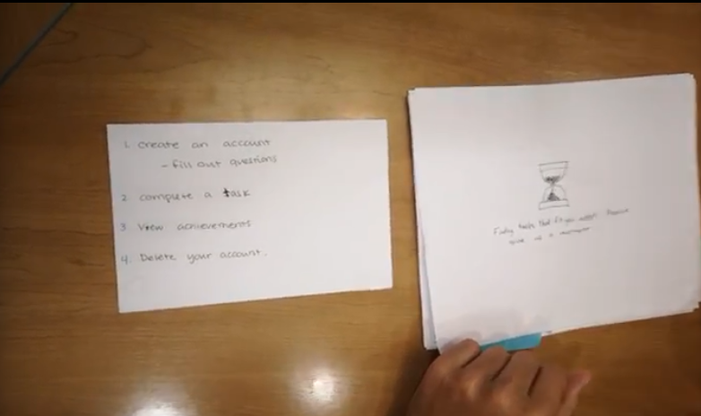

**Problem & Related Work (P1)**

Bad habits are easy to form and hard to break. When our brains learn new
behaviors and repeat them, the behavior starts to become habitual.The
“Habit Loop”, a concept developed by Charles Duhigg, outlines the fact
that when behaviors are repeated, they become habitual leading to less
of an emphasis on making decisions against bad habits, but rather,
skipping the decision making process altogether. We expect certain
rewards from certain behaviors so it's hard to override this automatic
process.

Many people are unhappy due to unhealthy and undesirable habits. While
people would like to make healthy lifestyle choices, behavioral changes
are difficult and many revert back to old habits. We are often too busy
with our dynamic modern lives to also build the motivation and momentum
to make the necessary changes. Social media exacerbates the issue by
forcing us to compare ourselves against the narrative of the perfect
life. People’s tendency to focus on the negative marginalizes their own
personal progress, making habit changes seem impossible to achieve. A
solution that helps people overcome unhealthy habits and replace them
with healthy routines would greatly improve our quality of life and
ability to self-actualize.

Bad habits are easy to form and hard to break, and we recognise this
truth. In fact, it is precisely the reason why we designed a website
that shifts our attitude towards our behaviors over time. People are
often innately stubborn when it comes to change, so we wanted to design
a product that all in all was fun, intuitive, and simple to use.  
Existing web-based habit trackers such as *habitify.me* and
*habitica.com* allow users to track their habits on any device. Habitify
uses a minimal interface, while Habitica uses gamification everywhere it
can. We aimed to create an app that includes some elements of
gamification without making the interface too saturated.

\`Bloom, our website, tracks your habits over time, helping the user
identify the ways in which certain habits can negatively impact their
life. In addition to this, it encourages the user to set realistic and
timely goals in order to replace their old habits with better ones.

**User Research (P2 & P3)**

There is a lot we initially wanted to learn from user interviews and
observations, including what habits contribute to well-being, what
habits detract from well-being, what kind of user will benefit from a
habit-changing app, etc. Ultimately we’d hoped to understand not only
more about how users would engage with our website, but also whether or
not the website would be of any real use.

Our research plan was very involved, considering the need to learn more
about the root cause of the problem, create mock scenarios, conduct user
testing, and more.Our interviews expressed the fact that many of us have
habits that we don’t like. From analyzing our user personas, scenarios,
and features, our team came to the conclusion that we needed to focus
our efforts on helping the user really understand their behavior and its
impacts on their life. From there we found from these scenarios that it
was imperative to have the user break their larger goals into smaller
more achievable goals for long term growth.

We also learned that a game-like design wasn’t compatible with the
majority of our user base and thus, we decided to switch to a more
generic design. Instead of being game-oriented, our habit breaking
website uses the growth of a flower to visually represent the user’s
progress in meeting their goal.

**Paper Prototyping (P4)**

From the paper prototyping, we learned in terms of usability, that our
user was confused by some of our design choices such as a lone email
prompt with no description. Finding things we initially thought easy to
find proved difficult during the paper prototyping as the user could not
find our achievements page. Our user mentioned that they wanted us to
ask them, “more personal questions” rather than only scratching the
surface of their problem. Even with its flaws, the concept of our
website was well received by our user.

We decided to make changes according to the feedback we received from
paper prototyping. We made the design of our website cleaner in
accordance with Norman’s principles of design. We made use of natural
mappings, made a minimalistic website which emphasized the important
parts of our website. Other resolutions include but are not limited to:

  - > Added a username function

  - > Made pages more accessible.

  - > Added more questions to sign up page

**High-Fidelity Prototyping (P5, P6, & P7)**

> A description of the tasks you decided to support. This should include
> screenshots of your app, with an explanation of how the various app
> features were intended to support the task.
>
> Component 1:
>
> User profiles: The login page allows, in theory, as many users to use
> the website as want to use it. The personal information of the user is
> stored using session storage. The questions answered by the user
> appear in the Goals portion of the website when a user creates a new
> account. 
>
> Component 2:
>
> Gamification: The user aims to complete a set of tasks that grow the
> size of a flower located on the Goals page of our website. When a task
> is completed, the flower adds a petal.
>
> Component 3:
>
> Data Visualization/Custom Calendar: The last is a cross between the
> two. While the user cannot directly add tasks to the calendar, and the
> data visualization is not necessarily tabular or graphical in nature,
> the User does update this calendar when crossing items off the list.
> Users can hover over a day-box in the “your stats for this year”
> section and the number of items crossed off in that day will be shown.
>
> 

**Reflection**

> What you managed to accomplish in the time you had
>
> We managed to build a simple and responsive website that helps the
> user break and form habits. Our site allows the user to establish
> goals and keep track of their tasks and achievements. We created login
> and signup forms that are intuitive and respond to user input. We
> integrated a questionnaire into the signup process to build a profile
> of the user’s struggles and goals. We use this information to populate
> the tasks component in our goals page. We implemented a flower SVG
> that grows as the user completes tasks, incentivising them to continue
> progressing toward their goals. We added a GitHub activity style
> calendar to the goals page to allow users to keep track of consistency
> and activity history. We created an achievements page that allows the
> user to reflect on their progress. We also made a settings page that
> allows the user to manage their account.
>
> The next steps of our app would likely be to add a back end to the
> website and more securely store our user’s data. A side effect of
> using cookies to store information is that it’s completely insecure.
> Adding a relational database to store user data including usernames,
> passwords, achievements and goals would increase the user capacity and
> functionality of the website immensely. In addition, the Achievements
> page is currently a facade. A roadmap to a good future page, nothing
> more. Implementing a backend to make this page functional would be
> another next step.

**Links**

> [https://github.com/330Flower/BuildAFlower/tree/project\_8](https://github.com/330Flower/BuildAFlower/tree/project_8)
>
> [https://330flower.github.io/BuildAFlower/](https://330flower.github.io/BuildAFlower/)
>
> Instructions:
>
> Works best on Safari full screen at 2880 x 1800
